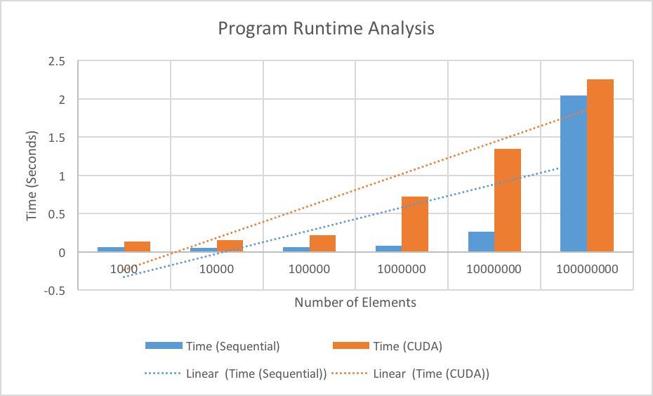

# Project Conclusions
By Jason Yao

## CUDA Server
The following data was compiled and tested on **CUDA server 5**.

## How block and grid sizes/dimensions were chosen
Since all of the CUDA compute servers on CIMS runs off new architecture
with a `Compute Capability` of `2.x -> 3.x`, that means that (from a hardware perspective) 
each block is limited to **1,024** threads per block.

Another reason to stick with 1,024 threads per block was because it was a nice
multiple of the warp size (which is currently 32 for these machines).

From this, the block dimensions are simply **32 x 32**. For the grid dimensions, it
was decided to just use a square formation. From the data's `n` value, it will thus be:

- `ceil(sqrt(n)/32) x ceil(sqrt(n)/32)`

## Compilation code
```sh
nvcc -g -m64 \
--generate-code arch=compute_20,code=sm_20 \
--generate-code arch=compute_30,code=sm_30 \
--generate-code arch=compute_35,code=sm_35 \
--generate-code arch=compute_37,code=sm_37 \
--generate-code arch=compute_50,code=sm_50 \
--generate-code arch=compute_52,code=sm_52 \
--generate-code arch=compute_52,code=compute_52 \
-o maxgpu maxgpu.cu
```

## The graph


## Programme runtime behaviour explaination
As we can see per the runtime graph, there was a marked increase in the time required to run
the parallel version of the code versus the sequential version, especially for when the number
of elements was relatively small (~100,000).

A reason for why the gpu began to do much better when the number of elements was due to the fact
that each block now had more elements to process, and thus each thread had more elements to process
in parallel, allowing the speedup to occur. Without those elements processing in parallel, the sequential
version would have continued to cost linear time bounded by `O(n)`, while in this version of the code,
it is still bounded by `O(n)`, but in reality is multiple factors faster given a large enough `n`.

A way to optimise the GPU code in the kernal further would be to implement a reduction algorithm that
could simplify and speedup the process to identify the maximum in the given array - it wasn't implemented
this time due to running into too many bugs and running out of time, but theoretically is the optimal solution
to find the maximum value of a given data array
